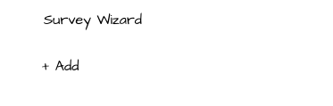
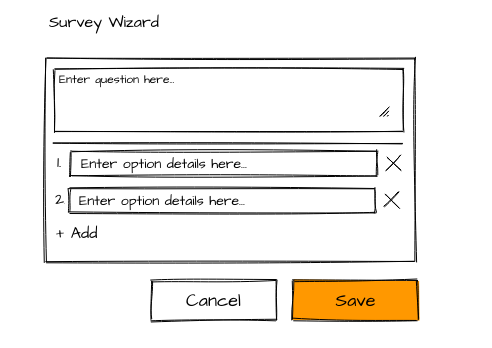
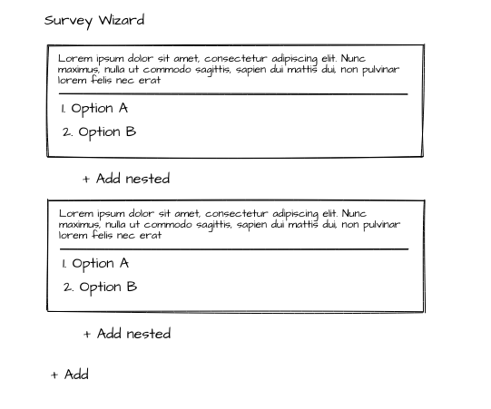
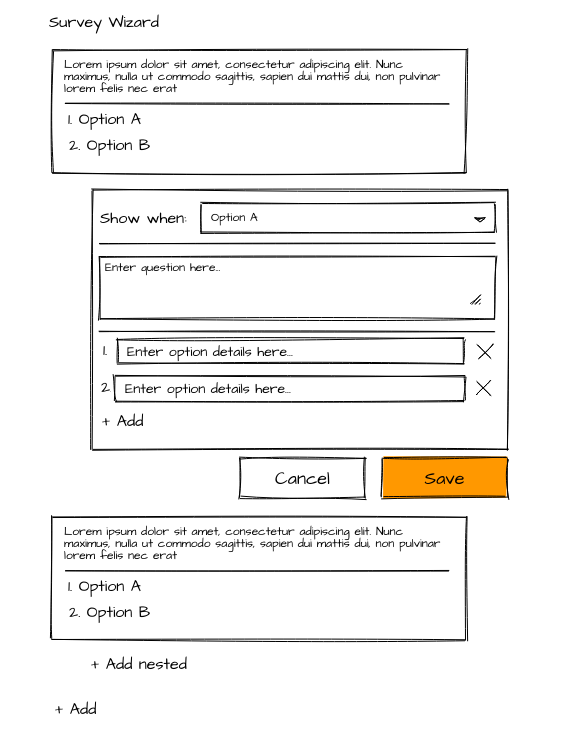
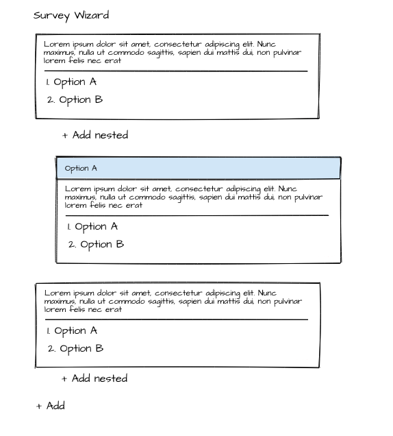
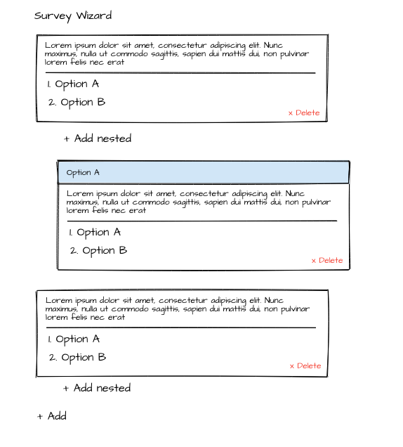

# Getting Started with Create React App

This solution is the result of completion a test task, according to which a Web application should be created in accordance with the following requirements:

- Tech stack requirements:
    - UI framework: React or Angular;
    - Back-end: TBD.

## Empty page

Page is loaded when app is launched and no data entered before.

| Control | Action | Behavior |
|---------|--------|----------|
| + Add | Click | Open new question form. |

## Add new question

New question form is opened on "Add" button click.

| Control | Action | Behavior |
|---------|--------|----------|
| Save | Click | Add static box with new question data to the page. See example below. |
| Cancel | Click | Remove form to add question. |

## 1st level questions list

| Control | Action | Behavior |
|---------|--------|----------|
| + Add | Click | Show form to add new question at the end of survey on 1st level. |
| Cancel | Click | Show n-level question form (see example below). Level of new question should be: parent question level + 1. |

## Add n-level question

Page is opened after click on "+ Add nested" link.

| Input | Validation |
|-------|------------|
| Options drop-down | User shouldn't be able to select option which already used in another inner question under the same parent question. |
| Question text / answers | Any text. |

| Control | Action | Behavior |
|---------|--------|----------|
| + Add | Click | Show form to add new question at the end of survey on 1st level. Hide already opened form. |
| + Add nested | Click | Show n-level question form (see example below). Level of new question should be: parent question level + 1. Hide already opened form. Button shouldn't be displayed if branches for all options are created. |
| Save | Click | Add static box with new question data to the page on proper level below of parent box. |
| Cancel  | Click | Remove form to add question. |

## n-level questions list

## Questions removal

| Control | Action | Behavior |
|---------|--------|----------|
| x Delete | Click | Remove specified element and all inner elements. |

---

This project was bootstrapped with [Create React App](https://github.com/facebook/create-react-app), using the [Redux](https://redux.js.org/) and [Redux Toolkit](https://redux-toolkit.js.org/) TS template.

## Available Scripts

In the project directory, you can run:

### `npm start`

Runs the app in the development mode.\
Open [http://localhost:3000](http://localhost:3000) to view it in the browser.

The page will reload if you make edits.\
You will also see any lint errors in the console.

### `npm test`

Launches the test runner in the interactive watch mode.\
See the section about [running tests](https://facebook.github.io/create-react-app/docs/running-tests) for more information.

### `npm run build`

Builds the app for production to the `build` folder.\
It correctly bundles React in production mode and optimizes the build for the best performance.

The build is minified and the filenames include the hashes.\
Your app is ready to be deployed!

See the section about [deployment](https://facebook.github.io/create-react-app/docs/deployment) for more information.

### `npm run eject`

**Note: this is a one-way operation. Once you `eject`, you can’t go back!**

If you aren’t satisfied with the build tool and configuration choices, you can `eject` at any time. This command will remove the single build dependency from your project.

Instead, it will copy all the configuration files and the transitive dependencies (webpack, Babel, ESLint, etc) right into your project so you have full control over them. All of the commands except `eject` will still work, but they will point to the copied scripts so you can tweak them. At this point you’re on your own.

You don’t have to ever use `eject`. The curated feature set is suitable for small and middle deployments, and you shouldn’t feel obligated to use this feature. However we understand that this tool wouldn’t be useful if you couldn’t customize it when you are ready for it.

## Learn More

You can learn more in the [Create React App documentation](https://facebook.github.io/create-react-app/docs/getting-started).

To learn React, check out the [React documentation](https://reactjs.org/).
